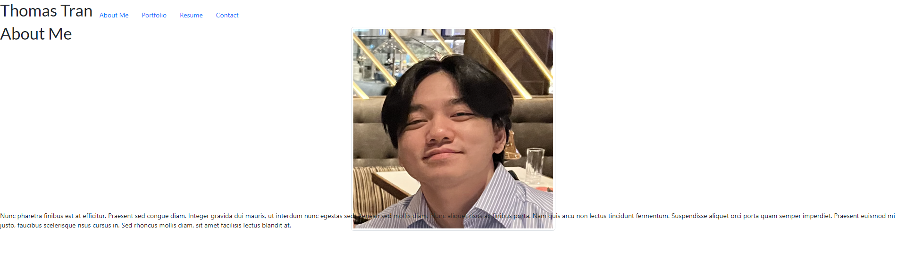

# Thomas-React-Portfolio

## Description
This is my portfolio which will showcase some of the many projects that I have had the opportunity to either refactor or create from scratch. My portfolio is a mobile responsive website with a navigation that has 4 tabs for each page. 

## Usage

## Features
- Navigation between 4 pages
- 2 short paragraphs about me and a picture of me on the about me page
- 6 images with links that send you to other works of mine
- A list of my web developer skills and a downloadable resume
- A short form with 3 fields for users to email me 

## Deployment
[Netlify](https://main--thomas-tran.netlify.app/)